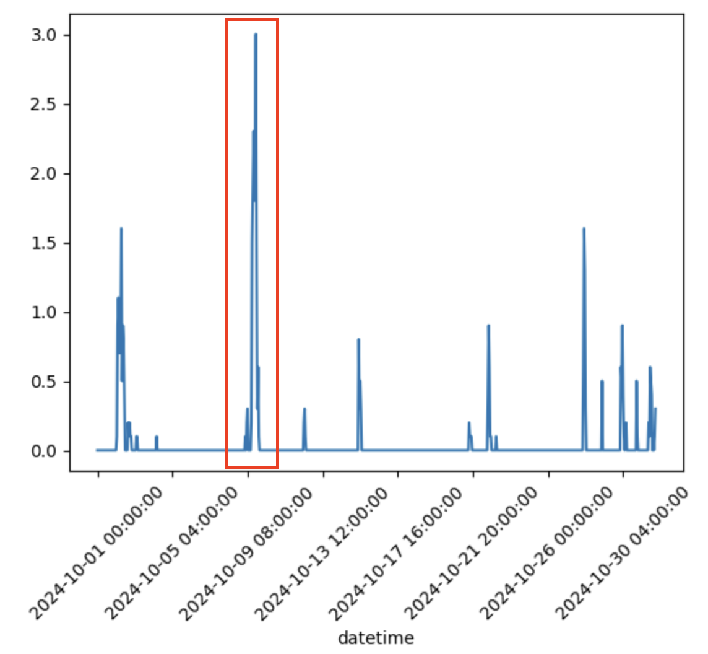
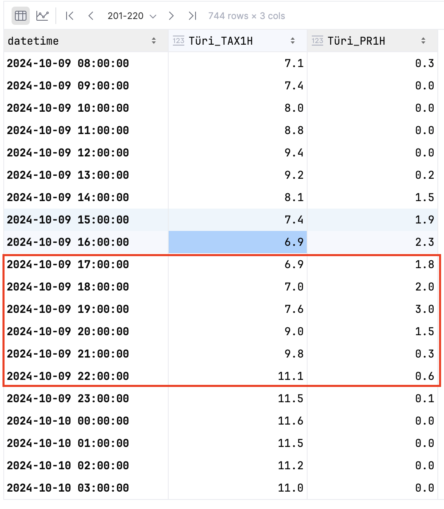

# Ilmaradar kodutöö juhend

| Student | Main_Station | Main_Year | Backup_Station | Backup_Year |
| --- | --- | --- | --- | --- |
| Yandar Alekseev | Türi | 2022 | Pärnu | 2025 |
| Iiris Aljes | Türi | 2021 | Valga | 2025 |
| Arina Gotsenko | Jõgeva | 2022 | Kuusiku | 2024 |
| Hele-Riin Hallik | Kihnu | 2021 | Kihnu | 2022 |
| Claudia-Isabel Huuse | Võru | 2022 | Valga | 2022 |
| Trinity Jõgisalu | Kihnu | 2020 | Tiirikoja | 2024 |
| Lisette Johanson | Võru | 2024 | Kuusiku | 2020 |
| Katarina Kaleininkas | Pärnu | 2022 | Võru | 2025 |
| Rene Kaur | Türi | 2020 | Valga | 2020 |
| Kaia Korman | Tiirikoja | 2023 | Võru | 2023 |
| Nikita Lagutkin | Pärnu | 2020 | Türi | 2025 |
| Margot Leheroo | Viljandi | 2025 | Kihnu | 2025 |
| Helena Heliise Mardi | Valga | 2024 | Pärnu | 2021 |
| Regina Poom | Tiirikoja | 2020 | Jõgeva | 2025 |
| Avely-Agnes Pumalainen | Pärnu | 2024 | Tooma | 2021 |
| Elisa Rajas | Viljandi | 2022 | Pärnu | 2023 |
| Kristjan Georg Ristmäe | Kihnu | 2023 | Viljandi | 2023 |
| Liis Seenemaa | Jõgeva | 2024 | Tartu-Tõravere | 2023 |
| Jaan Eerik Sorga | Kuusiku | 2023 | Viljandi | 2024 |
| Grete Anette Treiman | Viljandi | 2020 | Võru | 2020 |
| Taavi Tunis | Tiirikoja | 2025 | Tooma | 2024 |
| Heily Untera | Tartu-Tõravere | 2021 | Kihnu | 2024 |
| Mattias Tammi | Jõgeva | 2024 | Valga | 2023 |

Kodutöö tehakse ühe notebooki sees:
- `HW2-radar/hw2_course.ipynb`

Abiskriptid asuvad kaustas:
- `HW2-radar/scripts/`

Lisafailid (pildid ja kohalikud kaardifailid) asuvad kaustas:
- `HW2-radar/assets/`

## Python environment
Soovituslik Python versioon: `3.11`

Näide `venv + pip` kasutamiseks:

```bash
python -m venv .venv
# UNIX: source .venv/bin/activate         
# Windows: .venv\Scripts\activate
python -m pip install --upgrade pip
pip install -r requirements.txt
```

## 0. Määra oma parameetrid notebookis
Notebooki alguses on **Student Parameters** plokk. Muuda seal:
- `STATION_NAME`
- `STATION_COORDS` (lat, lon)
- `MEAS_START`, `MEAS_END`
- HILJEM (OSA 3) TULEB VALIDA  `RADAR_START`, `RADAR_END` 
- `ZR_A`, `ZR_B` (Z-R seos: `Z = a * R^b`)

## 1. Laadi mõõteandmed (paralleelselt)
Notebook kasutab:
- `scripts/measurement_download_parallel.py`

Allikas on Kliimaandmestik (KAUR API). Tulemused salvestatakse `data/` kausta.

## 2. Vaata sademete aegrida ja vali sobiv periood
Notebookis on graafik, millega valid radar-allalaadimise ajaakna.

Soovitus:
- kasuta 6–8 tunni akent,
- kus on nii väiksemaid kui suuremaid sademeväärtusi (mitte ainult üks ekstreemne tipp).
- sul on kasutada STD ja SCORE põhist filtreerimist, et `RADAR_START` ja `RADAR_END` mugavamalt valida

Abipildid:
- 
- 

## 3. Enne uut radar-allalaadimist puhasta vanad andmed
Notebookis on kontroll, mis otsib vanadest kaustadest faile:
- `data/radar_raw`
- `data/radar_unzipped`
- `data/radar_rainfall`

Kui andmed on olemas, küsitakse kinnitust enne kustutamist. 

*NB! Enne igat uut radari andmete alla laadimist peab kaustad vanadest andmetest tühjendama!*

## 4. Laadi radar RAW andmed
Notebook kasutab:
- `scripts/radar_download.py`

Lae andmed täpselt valitud perioodile (`RADAR_START` kuni `RADAR_END`).

## 5. Paki ZIP-failid lahti ja kontrolli puuduvaid ajamärke
Notebook kasutab:
- `scripts/radar_unzip.py`

Tulemusena tekib ka puuduvate andmete katvuse fail:
- `data/missing_data_final.csv`

## 6. Teisenda radarpeegeldus sademeks
Notebook kasutab:
- `scripts/radar_reflectivity_to_rainfall.py`

Oluline:
- Z-R parameetrid `a` ja `b` on notebookis muudetavad (`ZR_A`, `ZR_B`).
s
## 7. Ekstraheeri radarisadu jaamakoordinaadile
Notebook kasutab:
- `scripts/radar_extract.py`

Tulemus:
- `data/radar_rain_amount.csv`

## 8. Võrdle mõõdetud vs radarisadu
Notebook arvutab:
- Pearson korrelatsiooni
- RMSD (RMSE)
- kauguse radarist jaamani

Lisaks joonistatakse scatterplot:
- x-telg: mõõdetud sadu
- y-telg: radarist arvutatud sadu

## 9. Joonista radarikaardid
Notebook kasutab:
- `scripts/radar_plot.py`

Kaardile lisatakse:
- rannajoon (kohalik shapefile `assets/ne_50m_land`)
- jaamamarker
- radarimarker

## 10. Esitatavad failid Moodle'isse
Minimaalselt esita:
- raport (PDF)
- põhitulemuste joonised (scatter + radarikaardid)

## Märkus varuvariandi kohta
Kui põhi-jaamas/aastas ei ole sobivat sündmust, kasuta varu-jaama ja/või varu-aastat.
