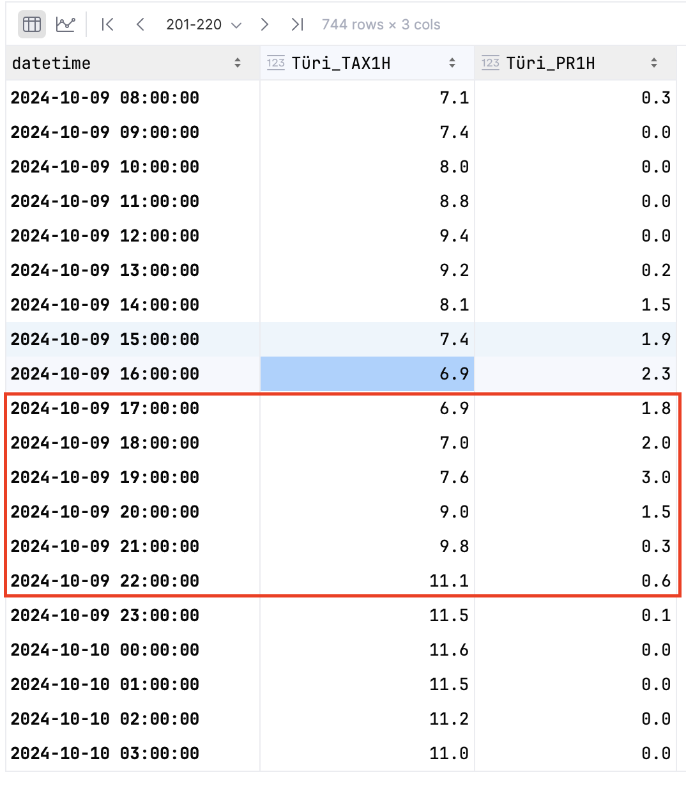

# Ilmaradar kodutöö juhend
Antud juhend näitab sammud, mis on vaja teha, et ilmaradari kodutöö valmis saaks.

### Python environment
- Projekti kaustas on requirements.txt file, mis defineerib vajalikud python paketid antud töö tegemiseks.
- Spyder kasutab conda
  - Kellel on ka Anaconda prompt, saab selle konsooliga environmente luua ja pakette installida
- Võib kasutada ka virtual environments: https://docs.python.org/3/library/venv.html
  - Vajab CMD programmi kasutamist või mõnda muud terminali 
  - Oluline on CMD või Anaconda prompt'iga liikuda sinna kausta, kus antud projekti failid on alla laetud.

>**using pip** (if environment is already created and activated)
> 
>pip install -r requirements.txt
>
>**using Conda**
> 
>conda create --name <env_name> --file requirements.txt

### 1. Download measurement data according to the table in the Moodle
The beginning of the homework. 

Please check the table in the Moodle to get the station and year index. Each student has main and backup station as well
as year from which suitable precipitations should be searched for. 
Each student has entire year when suitable rain event could be found (some station may not have data; also some radar 
data might be missing). 

Use the following script. 
**Read instructions** in the main function!
> measurement_download.py
 
### 2. Plot measurements and select 6h window where there is difference in rainfall amounts (e.g. 0.5 to 5 mm)

*NB! If no rainfall is registered for your year in your station, use the backup year and station.*

Depending on if you can use jupyter notebook or not, use either of the following scripts
> view_measurements.ipynb
> 
> view_measurements.py

*Alternatively view and plot the data in Excel.*

For example, the precipitation plot for entire month in Türi. Red rectangle highlights the period I am going to use. 

The data from downloaded measurements table from which I am going to extract start and end datetimes for downloading 
radar data. Red rectangle highlights the time period I am using in the analysis. 

### 3. Based on measurements, download the 6h RAW radar data (ideally 12 images per hour, 72 in total)

**Be prepared to select different period from measurements since radar data might not be available.**
In that case, please delete already downloaded data from radar_raw folder.
> radar_download.py

**Important:**
variables 'start_date' and 'end_date' in **radar_download.py** (at the end of the file) and **radar_unzip.py** 
(in the beginning) must be same. 

### 4. Unzip radar data
Just run the following script to unzip files:
> radar_unzip.py

Files are extracted into radar_unzipped folder which is created by the process.

### 5. Process radar to extract radar rainfall from RAW data
Run the following script to get hourly accumulation of rain
> radar_reflectivity_to_rainfall.py

In the data folder *radar_rainfall* folder is created. Within the created folder, folders *accumulated_rainfall* 
and *rainfall_intensities* are also created. 

Rainfall_intensities folder holds radar reflectivity to rainfall 
converted data arrays for each time stamp. It also includes metadata (i.e. azimuths, ranges, metadata) which are 
used to generate longitude and latitude arrays. 

Accumulated_rainfall folder will have several folders depending on the accumulation period the user has defined 
(by default, 1h rain accumulation is calculated). For example, in case of 1h accumulation period, all radar rainfall
values between 00:01 until 01:00 are summarized to get accumulated rainfall values for 01:00 hour. 

### 6. Extract accumulated rainfall from radar arrays
Find the coordinates (decimal) of the station in your analysis and run the following sctript:
> radar_extract.py

After running the script, you should have file radar_rain_amounts.csv

### 7. Plot results

> Write your own script to plot the data! 
> 
> You can use analyse_data.py for that (follow the instructions under if __name__ == __main__)

- Use matplotlib scatterplot
- Measured rainfall on x-axis, radar rainfall on y-axis
  - Do not forget to add names and units for each axis
- Calculate following statistics between measured rainfall and radar derived rainfall
  - Pearson correlation
  - Root Mean Squared Difference (RMSD which is same as RMSE if somebody is confused)
- Calculate distance between radar tower and your station
- Plot all 6 hours of radar data 
- > radar_plot.py

### 8. Create report

- Title page with credentials
- Description of what you did
  - Plot of measurements 
  - What interval was used to download radar data
- Description of results (scatterplot analysis) and statistics

### 9. Upload data and report to Moodle

Upload report as PDF and data as CSV file. 

### 10. Optional
Clean raw and unzipped radar files
> radar_clean_raw_files.py
