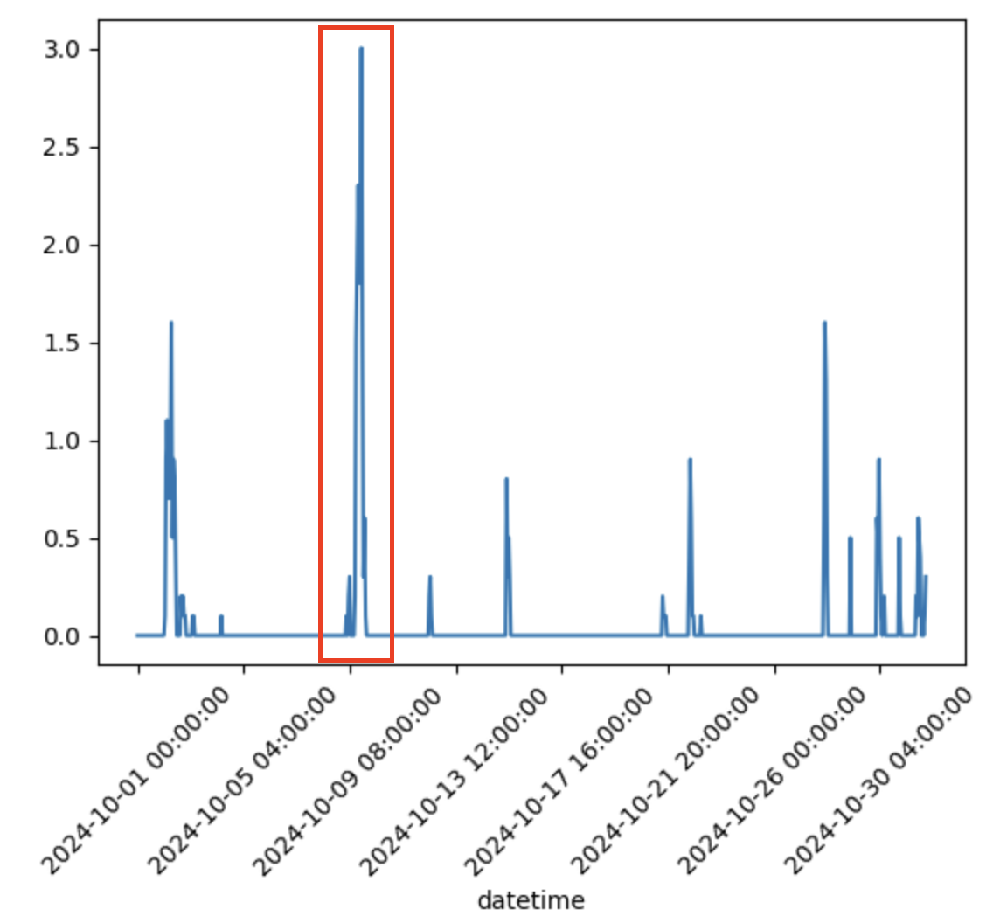
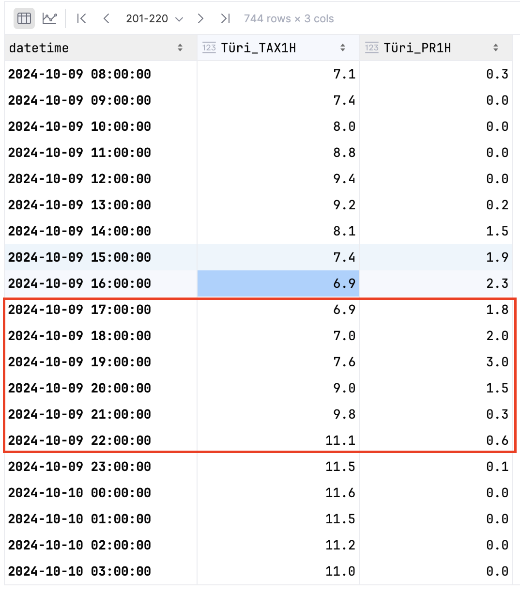

# Ilmaradar kodutöö juhend
Antud juhend näitab sammud, mis on vaja teha, et ilmaradari kodutöö valmis saaks

### 1. Download measurement data according to the table in the Moodle
The beginning of the homework. Please check the table in the Moodle to get the station and year-month index.
Use the following script. 
**Read instructions** in the main function!
> measurement_download.py
 
### 2. Plot measurements and select 6h window where there is difference in rainfall amounts (e.g. 0.5 to 5 mm)

*NB! If no rainfall is registered for your month in your station, use the backup month and station.*

Depending on if you can use jupyter notebook or not, use either of the following scripts
> view_measurements.ipynb
> view_measurements.py

*Alternatively view and plot the data in Excel.*

For example, the precipitation plot for entire month. Red rectangle highlights the period I am going to use. 

The data from downloaded measurements table from which I am going to extract start and end datetimes for downloading 
radar data. Red rectangle highlights the time period I am using in the analysis. 

### 3. Based on measurements, download the 6h RAW radar data (ideally 12 images per hour, 72 in total)
**Be prepared to select different period from measurements since radar data might not be available.**
> radar_download.py

### 4. Unzip radar data
Some text to clarify
> radar_unzip.py

### 5. Process radar to extract radar rainfall from RAW data
Some text to clarify
> ref_to_rainfall_v3.py

### 6. Plot results

- use matplotlib scatterplot
- measured rainfall on x-axis, radar rainfall on y-axis
  - do not forget units
- calculate following statistics between measured rainfall and radar derived rainfall
  - pearson correlation
  - root mean squared difference (RMSD which is same as RMSE if somebody is confused)
- calculate distance between radar tower and your station

### 7. Create report

- title page with credentials
- description of what you did
  - plot of measurements 
  - what interval was used to download radar data
- description of results (scatterplot analysis) and statistics

### 7. upload data and report to Moodle

old description left to delete, if everything is OK
download radar data

plot measured precipitation against radar values
calculate distance between station and radar
save data to csv -> upload to moodle

describe results